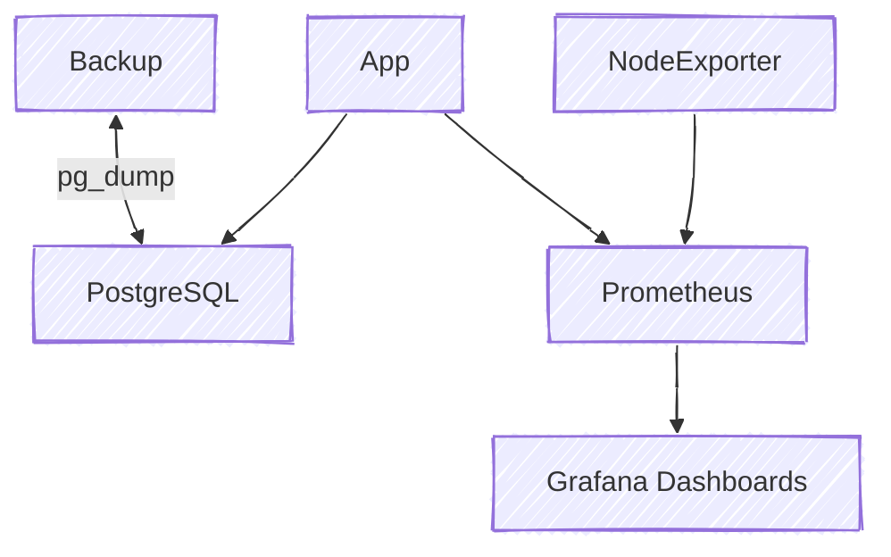
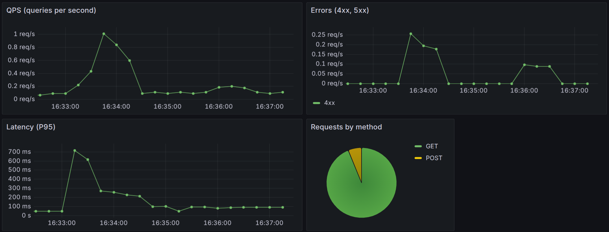

# 🚀 Docker Lab — Production-Ready Flask + CI/CD + Monitoring

A **DevOps showcase project** built to demonstrate **end-to-end software delivery** with modern practices:

* ✅ **Containerization**: Multi-stage Dockerfile, non-root user, healthchecks
* ✅ **Orchestration**: Docker Compose with Flask, PostgreSQL, Prometheus, Grafana, node-exporter
* ✅ **CI/CD**: GitHub Actions pipeline (lint → test → integration → scan → build → deploy)
* ✅ **Observability**: Metrics, health endpoints, Grafana dashboards
* ✅ **Security**: Trivy scans, no-new-privileges, read-only FS, `.dockerignore`
* ✅ **Data Safety**: Automated PostgreSQL backups

---

## 📊 Architecture



---

## 🛠️ Tech Stack

* **Language**: Python 3.13 (Flask, SQLAlchemy)
* **Database**: PostgreSQL 17
* **Containers**: Docker, Docker Compose
* **CI/CD**: GitHub Actions (`.github/workflows/ci-cd.yml`)
* **Monitoring**: Prometheus + Grafana + node-exporter
* **Security**: Trivy vulnerability scanning
* **Registry**: GitHub Container Registry (GHCR)

---

## ⚙️ Usage

### 🔹 Local Development

```bash
python -m venv .venv
source .venv/bin/activate
pip install -r app/requirements.txt -r app/requirements-dev.txt
python -m app
```

### 🔹 Run with Docker

```bash
docker build -t docker_lab:local ./app
docker run --rm -p 8000:8000 docker_lab:local
curl http://localhost:8000/health
```

### 🔹 Full Stack with Docker Compose

```bash
docker compose up --build -d

# Access:
# Flask API:   http://localhost:8081
# Prometheus:  http://localhost:9090
# Grafana:     http://localhost:3000 (admin/admin)
# Node Exporter: http://localhost:9100
```

---

## 🔄 CI/CD Pipeline

GitHub Actions workflow (`ci-cd.yml`) covers:

1. **Test & Lint**

   * Unit tests (`pytest`)
   * Linting (`ruff`) + format check (`black`)

2. **Integration Tests**

   * Start full Compose stack
   * Wait for healthchecks
   * Run DB CRUD tests via API (`/add`, `/list`, `/delete`)
   * Verify Prometheus scrapes + Grafana datasource
   * Test `backup.sh` script

3. **Build & Scan**

   * Build Docker image with SHA + `latest` tags
   * Scan with **Trivy** (fail on HIGH/CRITICAL)
   * Upload SARIF report to GitHub Security

4. **Push & Deploy**

   * Push image to GHCR
   * Deploy with Docker Compose on target host

---

## 📊 Monitoring

* **Prometheus** scrapes:

  * Flask app metrics (`/metrics`)
  * Host metrics (node-exporter)
* **Grafana Dashboards**:

  * Requests per second, latency, error rates, method breakdown

👉 Example panel:



---

## 🛡️ Security

* Containers run as **non-root** with `no-new-privileges`
* App container uses **read-only filesystem** + `tmpfs`
* Images scanned with **Trivy** during CI/CD
* `.dockerignore` excludes secrets, `.git`, `.venv`

---

## 💾 Backup Automation

`backup.sh` script ensures database safety:

* Uses `pg_dump` with timestamp
* Compresses backups into `.gz`
* Keeps only latest N backups (configurable)
* Verified in CI/CD integration tests

---

## 📚 Future Improvements

* Infrastructure as Code (Terraform, Ansible)
* Kubernetes manifests / Helm charts
* Centralized logging (Loki/ELK)
* CI/CD notifications to Slack/Discord
* SBOM + image signing (Cosign)

---

✍️ **Author:** [NailAmber](https://github.com/NailAmber)
📦 **Images:** [GHCR Packages](https://github.com/NailAmber?tab=packages)
📌 **License:** MIT
