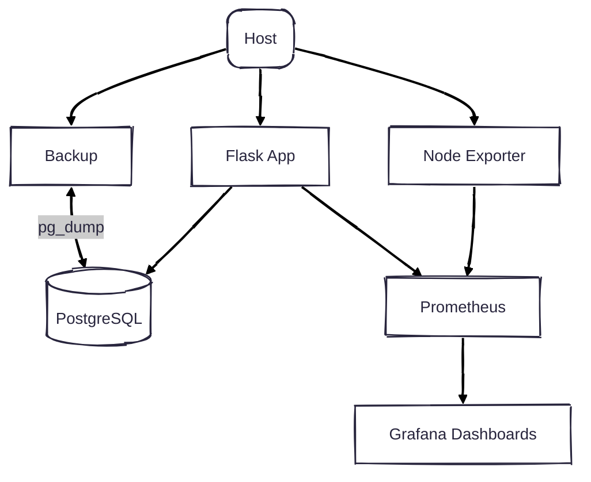

# 🚀 Docker Lab — Production-Ready Flask + CI/CD + Monitoring

A **DevOps showcase project**:\
A minimal Flask app packaged with **Docker**, orchestrated with **Compose**, observed with **Prometheus + Grafana**, and delivered via a **secure CI/CD pipeline**.

This repository is designed as a **portfolio project** to demonstrate **modern DevOps practices**:

- ✅ Containerization (multi-stage Dockerfile, non-root user, healthchecks)
- ✅ Multi-service orchestration (Flask, PostgreSQL, Prometheus, Grafana, node-exporter)
- ✅ CI/CD automation (lint, test, integration test, security scan, build & deploy)
- ✅ Observability & metrics (dashboards + alerting)
- ✅ Security practices (Trivy scans, no-privilege containers, `.dockerignore`)
- ✅ Backup automation for PostgreSQL

---

## 📊 Architecture


---

## 🛠️ Tech Stack

- **Language:** Python 3.13 (Flask)
- **Database:** PostgreSQL 17
- **Containerization:** Docker, Docker Compose
- **CI/CD:** GitHub Actions (build → test → scan → deploy)
- **Monitoring:** Prometheus + Grafana + node-exporter
- **Security:** Trivy vulnerability scans
- **Registry:** GitHub Container Registry (GHCR)

---

## ⚙️ Usage

### Local Development

```bash
python -m venv .venv
source .venv/bin/activate
pip install -r app/requirements.txt -r app/requirements-dev.txt
python -m app
```

### Docker Only

```bash
docker build -t docker_lab:local ./app
docker run --rm -p 8000:8000 docker_lab:local
curl http://localhost:8000/health
```

### Full Stack with Compose

```bash
docker compose up --build -d

# Access:
# App:        http://localhost:8081
# Prometheus: http://localhost:9090
# Grafana:    http://localhost:3000  (admin/admin)
# Node Exporter: http://localhost:9100
```

---

## 🔄 CI/CD Pipeline

GitHub Actions workflow (`.github/workflows/ci-cd.yml`):

1. **Test & Lint**

   - Run unit tests with pytest
   - Lint with Ruff + format check with Black

2. **Integration Test**

   - Spin up Compose stack (app + db + monitoring)
   - Wait for services to be healthy
   - Verify metrics are scraped + Grafana datasource available
   - Backup script verification

3. **Build & Scan**

   - Build Docker image (tagged with commit SHA + `latest`)
   - Scan image with Trivy (fail on HIGH/CRITICAL)
   - Upload scan report to GitHub Security

4. **Push & Deploy**

   - Push image to GHCR
   - Pull + deploy with Docker Compose

---

## 📊 Monitoring

- **Prometheus** scrapes:
  - Flask metrics (`/metrics`)
  - Host metrics (node-exporter)
- **Grafana Dashboards**:
  - QPS, error rate, latency, method breakdown  

👉 Example panels: 

---

## 🛡️ Security

- Containers run as **non-root** with `no-new-privileges`
- Images scanned by **Trivy** in CI
- `.dockerignore` excludes secrets, `.git`, `.venv`
- Read-only root FS (`read_only: true`) for app container

---

## 💾 Backup Automation

`backup.sh` script:

- Runs `pg_dump` with timestamp
- Produces compressed archive
- Verified during CI integration tests

---

## 🚀 Demo Tips (for Interview)

- Show `docker-compose.yml`: healthchecks, security opts, volumes.
- Walk through Dockerfile: multi-stage, tini, non-root, healthcheck.
- Demo GitHub Actions pipeline.
- Open Grafana dashboard to show metrics.
- Show GHCR packages: rollback capability with commit-tagged images.

---

## 📚 Next Steps (Future Work)

- IaC with Terraform/Ansible (deploy to cloud)
- Kubernetes manifests/Helm for orchestration
- Centralized logging (Loki/ELK)
- CI/CD notifications to Slack/Discord
- Image signing (Cosign), SBOM generation

---

✍️ **Author:** [NailAmber](https://github.com/NailAmber)\
📦 Images: [GHCR Packages](https://github.com/NailAmber?tab=packages)\
📌 License: MIT
